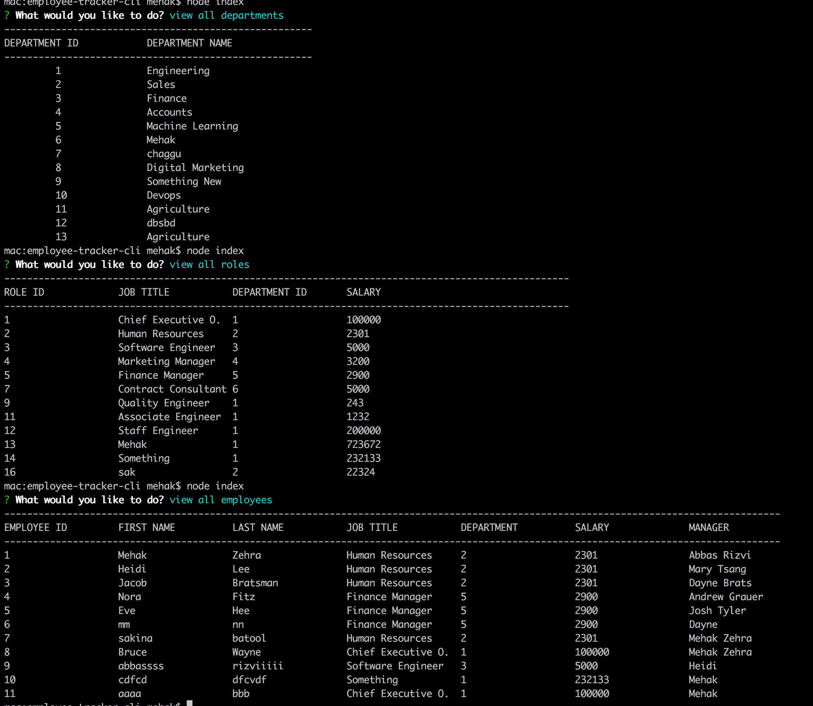

# employee-tracker-cli
# Readme Generator
  

  ## Description  
 This is a Employee Tracker application with command line where user would be able to view and manage the departments, roles, and employees of their company and organize their bussiness plan accordingly.

  ## Table Of Content  
 
  * [Installation](#installation)
  * [Getting Started](#gettingStarted)
  * [Screenshots](#screenshots)
  * [Video Walk-through](#videoWalkThrough)
  * [Technologies](#technologies)
  * [Questions](#questions)
  * [Contributor](#contributor)
  
  ## Installation  

  To install dependencies run this command 

  ```npm install inquirer``` 
      and 
  ``` Download mysql for database```


  ## Getting Started 

  After you have cloned the git repository, and ran the necessary installs, execute the either of the following command to run the application in the root directory

  ```node index.js``` 
        OR 
   ```node index```

 ## Screenshots

  
  
  ## Video Walk-through
  https://drive.google.com/file/d/1PwlpNCokcJwDPtRbiWDE-y55fRgt7v9_/view?usp=sharing
  
  ## Technologies

    Node.js
    NPM
    Inquirer.js
    Mysql
  
  ## Questions  

  For questions about this project, please see my GitHub at [mehak-zehra](https://github.com/mehak-zehra)  (Or) 

  Contact me at mehak.rizvi.786@gmail.com

   ## Contributor  

  Mehak Zehra ♥ 